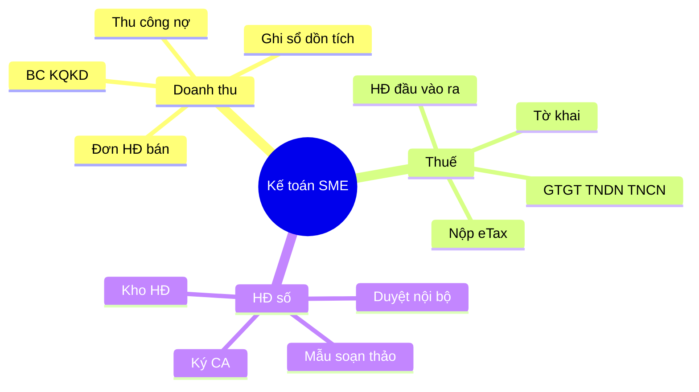
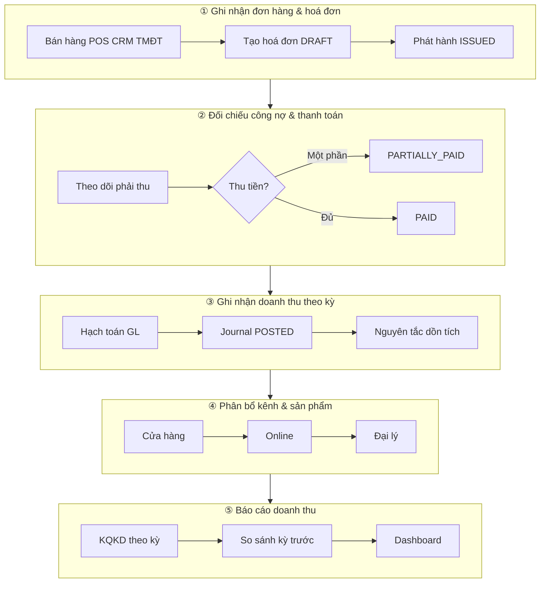
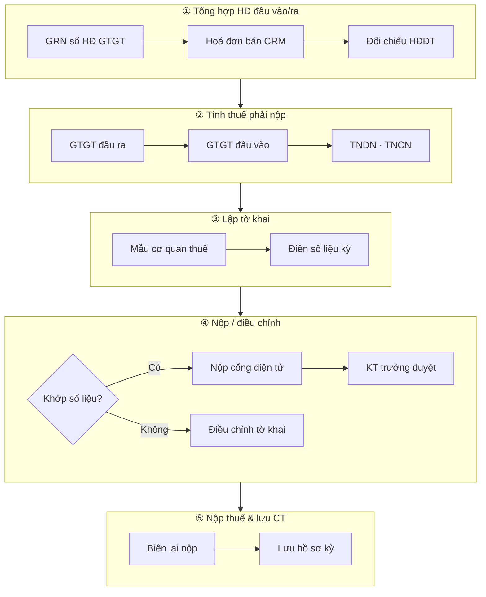
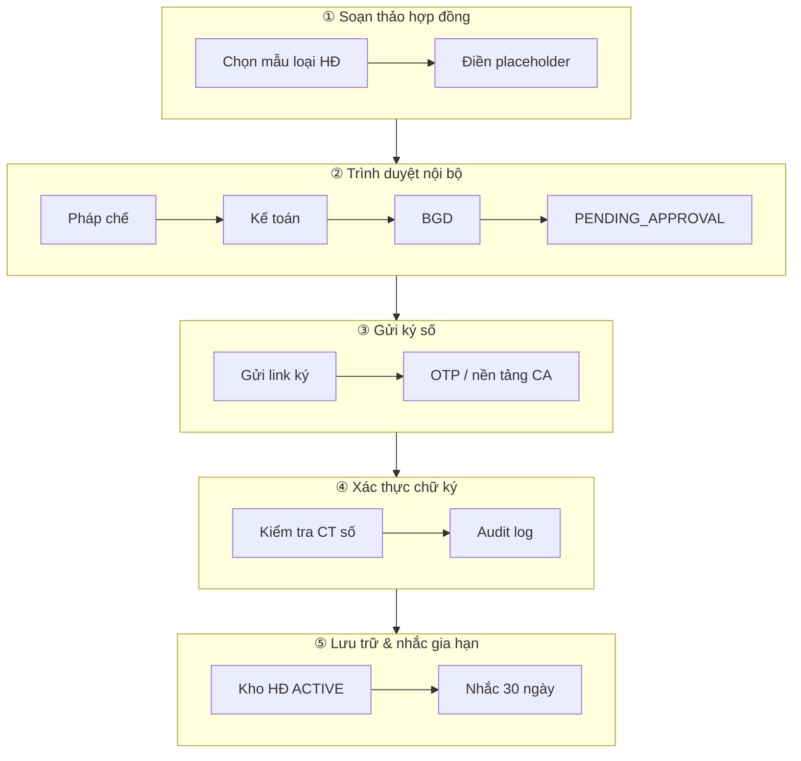

# Frezo Kế toán — Workflow Doanh thu · Thuế · Hợp đồng số

> **Tài liệu BA nội bộ module Kế toán / CRM / Hợp đồng** · Phân khúc: SME / mid-market VN · Cập nhật: 2026-07-29  
> Tham chiếu giọng BA/EU theo `ba-srs.mdc` · Pattern UI: `HR_WORKFLOW_QLNS.md`

---

## Mục lục

1. [Context vận hành](#1-context-vận-hành)
2. [Luồng 1 — Doanh thu (Revenue)](#2-luồng-1--doanh-thu-revenue)
3. [Luồng 2 — Kê khai thuế (Tax)](#3-luồng-2--kê-khai-thuế-tax)
4. [Luồng 3 — Hợp đồng số (Digital contract)](#4-luồng-3--hợp-đồng-số-digital-contract)
5. [Ma trận Frezo: Có / Thiếu / Sprint](#5-ma-trận-frezo-có--thiếu--sprint)
6. [Mockup text màn hình](#6-mockup-text-màn-hình)

---

## 1. Context vận hành

### 1.1 Actor & quyền (gợi ý)

| Vai trò | Trách nhiệm chính | Màn hình thường dùng |
|---------|-------------------|----------------------|
| **Kinh doanh / POS** | Tạo đơn, phát hành hoá đơn | CRM Hoá đơn, Deal |
| **Kế toán** | Thu công nợ, hạch toán, báo cáo, kê khai thuế | Hoá đơn, Journal, BCĐKT/KQKD, Tờ khai GTGT |
| **Kế toán trưởng** | Duyệt tờ khai, nộp cổng thuế | Tờ khai GTGT (P1 workflow duyệt) |
| **Pháp chế / HR** | Soạn & duyệt HĐ, ký số | Hợp đồng, Ký điện tử |
| **Ban giám đốc** | Duyệt HĐ giá trị lớn | Hộp thư duyệt |

### 1.2 Ba luồng mấu chốt



---

## 2. Luồng 1 — Doanh thu (Revenue)

### 2.1 Tổng quan luồng



### 2.2 Chi tiết từng bước (EU)

| # | Hành động EU | Màn Frezo | Ghi chú |
|---|--------------|-----------|---------|
| 1.1 | Ghi nhận đơn & tạo HĐ | `/crm/invoices` | Từ Deal hoặc nhập tay |
| 1.2 | Phát hành HĐ | **Phát hành** | DRAFT → ISSUED |
| 2.1 | Thu tiền / đối chiếu CN | **Thu tiền** | PARTIALLY_PAID / PAID |
| 3.1 | Hạch toán doanh thu kỳ | **Hạch toán** → `/accounting/journals` | Post GL TK 511, 131 |
| 4.1 | Phân bổ kênh & SP | — | ⚠️ P1 — chưa dimension kênh |
| 5.1 | Báo cáo DT | `/accounting/financial-statements` (KQKD) | So sánh kỳ: P1 |

---

## 3. Luồng 2 — Kê khai thuế (Tax)

### 3.1 Tổng quan luồng



### 3.2 Chi tiết (EU)

| # | Hành động | Màn hình | Trạng thái Frezo |
|---|-----------|----------|------------------|
| 2.1 | HĐ đầu vào trên GRN | `/warehouse/grn` | ✅ invoiceNo trên GRN |
| 2.2 | HĐ đầu ra | `/crm/invoices` | ✅ |
| 2.3 | Tổng hợp GTGT tháng | `/accounting/tax` | ✅ BE stub API |
| 2.4 | Lập & nộp tờ khai XML | Ngoài Frezo (eTax) | ❌ P1 |
| 2.5 | Lưu chứng từ nộp | Thủ công / drive | ❌ P1 attachment |

---

## 4. Luồng 3 — Hợp đồng số (Digital contract)

### 4.1 Tổng quan luồng



### 4.2 Chi tiết (EU)

| # | Hành động | Màn hình | Trạng thái Frezo |
|---|-----------|----------|------------------|
| 3.1 | Soạn từ mẫu | `/qlns/contract/create` | ✅ Template + AI |
| 3.2 | Duyệt nội bộ | `/qlns/contract/:id` · Hộp thư | ✅ PENDING → ACTIVE |
| 3.3 | Gửi ký số | `/qlns/contract/sign/:id` | ✅ OTP stub |
| 3.4 | Xác thực CA | Audit sau ký | ⚠️ Chưa tích hợp CA thật |
| 3.5 | Kho HĐ + nhắc gia hạn | `/qlns/contract` | ✅ Nhãn sắp hết hạn |

---

## 5. Ma trận Frezo: Có / Thiếu / Sprint

> Audit code FE/BE · 2026-07-29

| Nghiệp vụ | Frezo hiện tại | Gap | Sprint đề xuất |
|-----------|----------------|-----|----------------|
| **Hoá đơn bán + phát hành + thu tiền** | ✅ `/crm/invoices` | Chưa POS/TMĐT sync | P1 |
| **Hạch toán HĐ → GL** | ✅ post-gl | — | **P0 done** |
| **Pipeline doanh thu 5 bước (stepper)** | ✅ FE 3 màn | Phân bổ kênh chưa có | **P0 — FE** (done) |
| Báo cáo DT so kỳ Dashboard | ⚠️ KQKD | Widget so sánh kỳ | P1 |
| Dimension kênh (CH/online/đại lý) | ❌ | Analytics tag trên Invoice | P2 |
| **Tổng hợp GTGT stub** | ✅ BE `/accounting/tax/vat` | TNDN/TNCN auto | **P0 — FE page** (done) |
| Đối chiếu HĐĐT (MISA/eInvoice) | ❌ | API hóa đơn điện tử | P1 |
| Lập & nộp tờ khai XML | ❌ | Module eTax export | P1 |
| Workflow duyệt tờ khai | ❌ | Approval template | P1 |
| **HĐ mẫu + duyệt + ký OTP** | ✅ contracts module | CA provider thật (VNPT/Viettel) | P1 |
| Xác thực CT số CA | ⚠️ Audit stub | Tích hợp CA API | P2 |
| **Pipeline HĐ số 5 bước (stepper)** | ✅ FE contract pages | — | **P0 — FE** (done) |

### 5.1 Roadmap tóm tắt

| Sprint | Phạm vi | FR-ID gợi ý |
|--------|---------|-------------|
| **P0** (done) | BA doc, stepper 3 luồng, PageGuide, guide seed | FR-ACC-01..03 |
| **P1** | eTax export, HĐĐT sync, duyệt tờ khai, CA thật | FR-ACC-10..14 |
| **P2** | Phân bổ kênh DT, POS sync | FR-ACC-20..22 |

---

## 6. Mockup text màn hình

> Mockup text theo chuẩn FE — route, fields, validation, 1 primary action.

---

### 6.1 Màn hình 1 — Doanh thu / Hoá đơn

**Route:** `/crm/invoices` (bước 1–2) · `/accounting/journals` (bước 3) · `/accounting/financial-statements` (bước 5)

**Header Hoá đơn**

```
Hoá đơn bán hàng                    [Hướng dẫn]
Pipeline: Ghi nhận đơn & HĐ → Đối chiếu & thu tiền → … → Báo cáo DT
Tổng phải thu: 125.000.000 ₫
Filter: Tất cả | Nháp | Đã phát hành | Trả một phần | Đã thanh toán
```

**Row actions**

| Trạng thái | Primary |
|------------|---------|
| DRAFT | **Phát hành** |
| ISSUED / PARTIALLY_PAID | **Thu tiền** |
| ISSUED (chưa GL) | **Hạch toán** |

**Empty:** *"Chưa có hoá đơn. Tạo từ Deal hoặc thêm mới."*

---

### 6.2 Màn hình 2 — Kê khai thuế GTGT

**Route:** `/accounting/tax`

**Header**

```
Tờ khai GTGT · T07/2026              [Hướng dẫn]
Pipeline: Tổng hợp HĐ → Tính thuế → Lập tờ khai → Nộp/Điều chỉnh → Lưu CT
```

**Filter**

| Field | Loại | Validation |
|-------|------|------------|
| Năm | Select | Required |
| Tháng | Select 1–12 | Required |

**KPI cards**

```
GTGT đầu ra    │ GTGT đầu vào   │ GTGT phải nộp (ròng)
511.000.000 ₫  │ 380.000.000 ₫  │ 131.000.000 ₫
```

**Primary:** `Tổng hợp`

**Gap P1 — Nộp tờ khai mockup**

```
Tờ khai GTGT T07/2026 — Bước 4/5
☑ Số liệu khớp sổ · KT trưởng: [Chờ duyệt]
Primary: [Xuất XML tờ khai] → mở eTax
Nhánh: [Điều chỉnh] nếu netVat ≠ TK 3331
```

---

### 6.3 Màn hình 3 — Hợp đồng số

**Route:** `/qlns/contract` · `/qlns/contract/:id` · `/qlns/contract/sign/:id`

**Header danh sách**

```
Hợp đồng lao động                   [Hướng dẫn HĐ số] [Vòng đời HĐ]
Pipeline: Soạn thảo → Duyệt nội bộ → Ký số → Xác thực → Lưu trữ
KPI: Tổng | Chờ duyệt | Hiệu lực | Sắp hết hạn
Primary: [Tạo hợp đồng]
```

**Chi tiết HĐ — bước ký**

```
HĐ-LĐ-2026-0042 · Thử việc — Nguyễn Văn A
Stepper highlight: Gửi ký số
Primary: [Mở trang ký] → /qlns/contract/sign/:id
OTP → Xác thực → Audit ✓
```

---

## Phụ lục

### A. Liên kết tài liệu & guide

| Tài liệu | Path |
|----------|------|
| EU guide Doanh thu | `/docs/guide-accounting-revenue` |
| EU guide Kê khai thuế | `/docs/guide-accounting-tax` |
| EU guide Hợp đồng số | `/docs/guide-contract-digital` |
| BA workflow (file này) | `modules/accounting/ACCOUNTING_WORKFLOW.md` |

### B. Acceptance Criteria tóm tắt (FR-ACC-01 — Stepper)

**AC-1 — Revenue pipeline**

- **Given** mở `/crm/invoices` có HĐ ISSUED chưa thu  
- **When** HR/Kế toán xem stepper  
- **Then** highlight bước «Đối chiếu & thu tiền»

**AC-2 — Tax pipeline**

- **Given** đã tổng hợp GTGT tháng  
- **When** mở `/accounting/tax`  
- **Then** Stepper highlight «Tính thuế phải nộp»

**AC-3 — Digital contract pipeline**

- **Given** HĐ PENDING_APPROVAL  
- **When** mở `/qlns/contract/:id`  
- **Then** Stepper highlight «Trình duyệt nội bộ»

---

*Tài liệu nội bộ module Kế toán — Frezo ERP · BA House · 2026-07-29*
