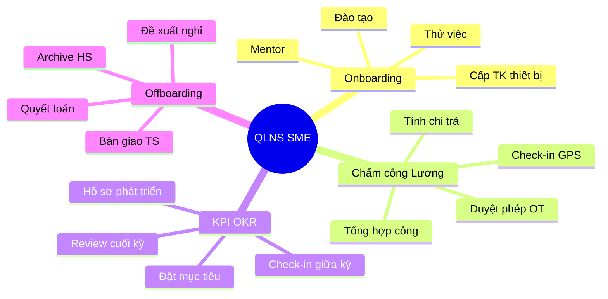
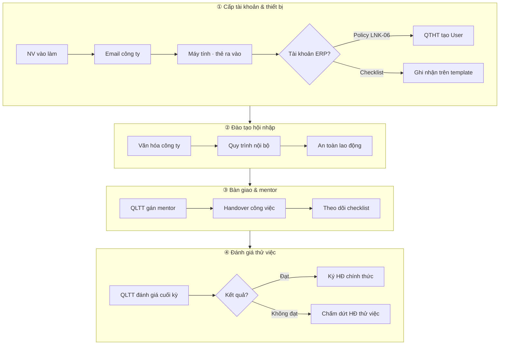
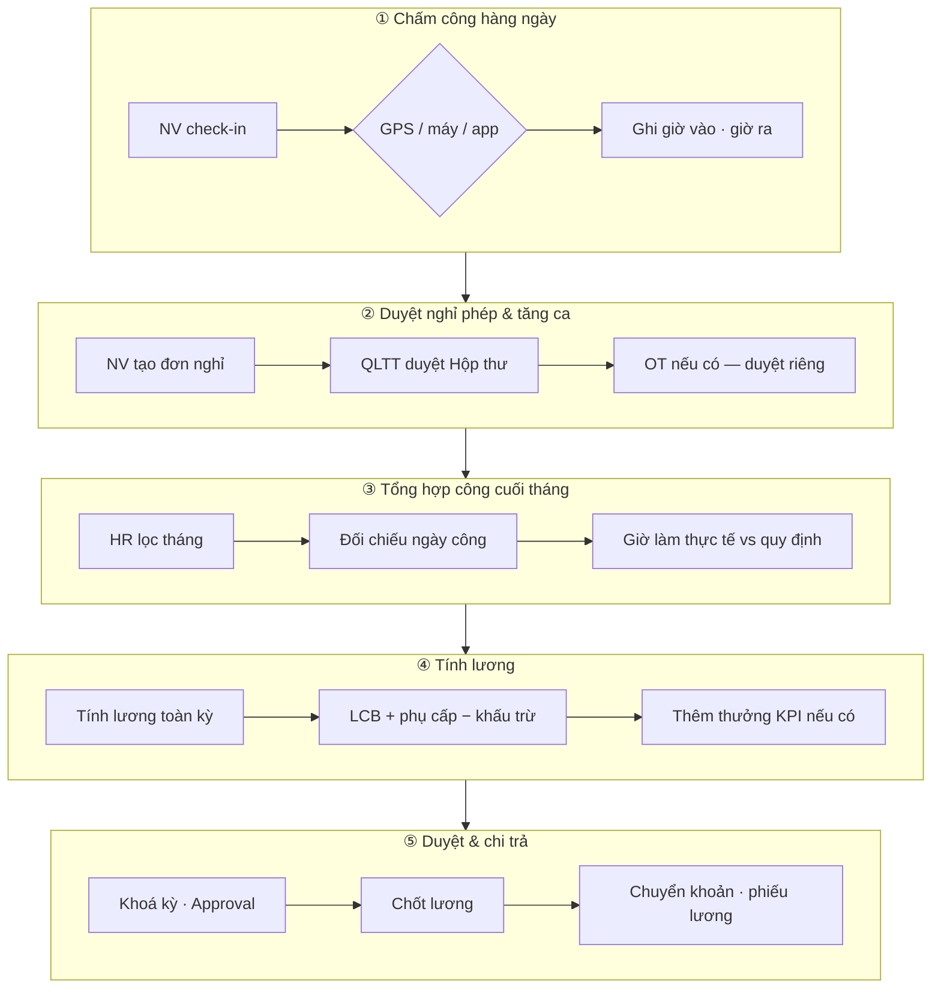
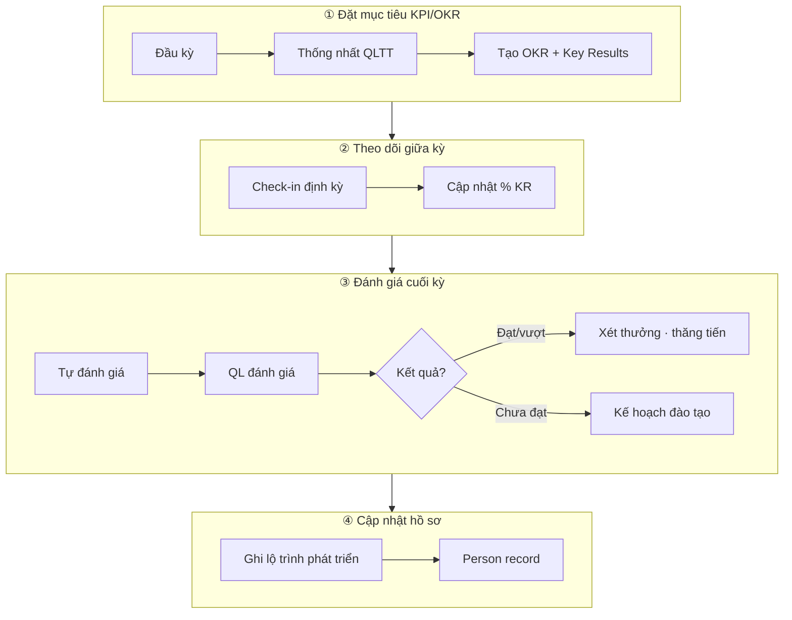
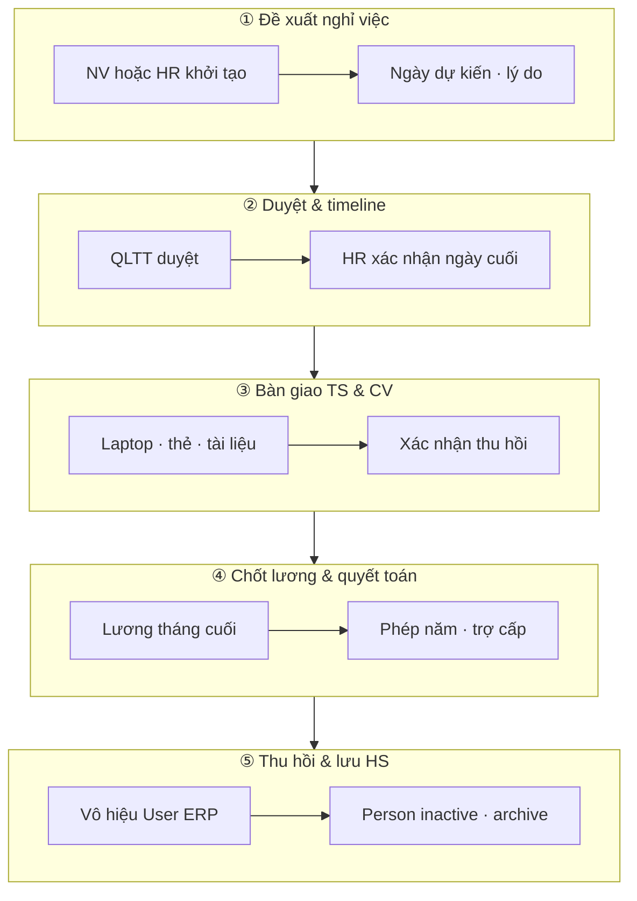

# Frezo QLNS — Workflow Quản lý nhân sự

> **Tài liệu BA nội bộ module Nhân sự (QLNS)** · Phân khúc: SME / mid-market VN · Cập nhật: 2026-07-29  
> Tham chiếu giọng BA/EU theo `ba-srs.mdc` · Pattern UI: `WAREHOUSE_WORKFLOW_SME_RAU_CU.md`

---

## Mục lục

1. [Context vận hành HR](#1-context-vận-hành-hr)
2. [Luồng 1 — Onboarding / Thử việc](#2-luồng-1--onboarding--thử-việc)
3. [Luồng 2 — Chấm công & Lương](#3-luồng-2--chấm-công--lương)
4. [Luồng 3 — KPI / OKR](#4-luồng-3--kpi--okr)
5. [Luồng 4 — Nghỉ việc / Offboarding](#5-luồng-4--nghỉ-việc--offboarding)
6. [Ma trận Frezo: Có / Thiếu / Sprint](#6-ma-trận-frezo-có--thiếu--sprint)
7. [Mockup text màn hình](#7-mockup-text-màn-hình)

---

## 1. Context vận hành HR

### 1.1 Actor & quyền (gợi ý)

| Vai trò | Trách nhiệm chính | Màn hình thường dùng |
|---------|-------------------|----------------------|
| **HR / HCNS** | Onboarding, hồ sơ, chốt công, tính lương, offboarding | Person, Onboarding, Chấm công, Bảng lương |
| **Quản lý trực tiếp (QLTT)** | Duyệt nghỉ/OT, mentor, đánh giá thử việc & KPI | Hộp thư duyệt, OKR, Performance review |
| **Nhân viên** | Check-in/out, xin nghỉ, tự đánh giá KPI | Chấm công, Nghỉ phép, Profile |
| **Kế toán** | Chốt & chi trả lương, hạch toán GL | Bảng lương, Kế toán |
| **QTHT / Admin** | Cấp User ERP, khóa tài khoản khi nghỉ | Người dùng (LNK-06) |

### 1.2 Bốn luồng mấu chốt



---

## 2. Luồng 1 — Onboarding / Thử việc

### 2.1 Tổng quan luồng



### 2.2 Chi tiết từng bước (EU)

| # | Hành động EU | Nút UI gợi ý | Ghi chú |
|---|--------------|--------------|---------|
| 1.1 | HR tạo/chọn template checklist | **Template mới** | Mặc định: máy, email, training, giấy tờ |
| 1.2 | Gán Person mới vào template | **Gán Person** | Link Person ID từ tuyển dụng |
| 1.3 | QTHT cấp User (ngoài onboarding) | — | Route `/qtht/users` |
| 2.1 | Mentor/HR đánh dấu hạng mục xong | **Xong** từng item | Progress % tự tính |
| 3.1 | QLTT theo sát công việc thực tế | Tab **Tiến độ** | |
| 4.1 | QLTT đánh giá hết thử việc | — (P1: form đánh giá) | Chuyển HĐ tại `/qlns/contract` |

---

## 3. Luồng 2 — Chấm công & Lương

### 3.1 Tổng quan luồng



### 3.2 Chi tiết từng bước (EU)

| # | Hành động EU | Màn Frezo | Ghi chú |
|---|--------------|-----------|---------|
| 2.1 | Check-in/out hàng ngày | `/admin/attendance` | GPS policy: guide-attendance-settings |
| 2.2 | Duyệt đơn nghỉ | Tab **Đơn nghỉ phép** · `/approval/inbox` | LEAVE.APPROVE |
| 2.3 | Chốt bảng công tháng | Tab **Danh sách** · roster ngày | HR review trước tính lương |
| 2.4 | Tính lương kỳ | `/qlns/payrolls` · **Tính lương kỳ này** | Cần HĐ ACTIVE |
| 2.5 | Chốt → Thanh toán | ✅ Chốt · 💵 Paid | Payslip drawer |

---

## 4. Luồng 3 — KPI / OKR

### 4.1 Tổng quan luồng



### 4.2 Chi tiết (EU)

| # | Hành động | Màn hình | Trạng thái Frezo |
|---|-----------|----------|------------------|
| 3.1 | Tạo OKR kỳ | `/qlns/okrs` | ✅ CRUD OKR + KR |
| 3.2 | Check-in giữa kỳ | Cập nhật `currentValue` KR | ⚠️ Chưa wizard check-in |
| 3.3 | Review cuối kỳ | `/qlns/performance-reviews` | ✅ Self + manager score |
| 3.4 | Cập nhật hồ sơ | `/qlns/persons` | ⚠️ Chưa tab lộ trình riêng |

---

## 5. Luồng 4 — Nghỉ việc / Offboarding

### 5.1 Tổng quan luồng



### 5.2 Chi tiết (EU) — vận hành thủ công trên Frezo hiện tại

| # | Bước | Cách làm hôm nay | Gap |
|---|------|------------------|-----|
| 4.1 | Đề xuất | Email/form ngoài hoặc ghi chú HR | ❌ Module đơn nghỉ việc |
| 4.2 | Duyệt | Workflow engine (nếu cấu hình) | ⚠️ Chưa template offboarding |
| 4.3 | Bàn giao TS | `/assets` thu hồi | ⚠️ Chưa link Person offboarding |
| 4.4 | Quyết toán | `/qlns/payrolls` tháng cuối | ✅ |
| 4.5 | Archive | Person deactivate + khóa User | ⚠️ Thủ công 2 màn |

---

## 6. Ma trận Frezo: Có / Thiếu / Sprint

> Audit code FE/BE QLNS · 2026-07-29

| Nghiệp vụ | Frezo hiện tại | Gap | Sprint đề xuất |
|-----------|----------------|-----|----------------|
| **Onboarding wizard (template → gán → tiến độ)** | ✅ `/qlns/onboarding` | Chưa map 4 bước nghiệp vụ + đánh giá thử việc | **P0 — FE stepper** (done) |
| Cấp User từ onboarding | ❌ Policy LNK-06 | QTHT riêng — đúng thiết kế | — |
| Đánh giá kết thúc thử việc (form) | ❌ | Entity `probation_review` + link HĐ | **P1 — BE+FE** |
| **Chấm công GPS/check-in** | ✅ `/admin/attendance` | OT workflow riêng chưa có | P1 |
| **Đơn nghỉ phép + duyệt** | ✅ Tab leaves · Hộp thư | — | **P0 done** |
| Tổng hợp công cuối tháng (report) | ⚠️ List + heatmap | Export chốt công HR | P1 |
| **Tính lương / chốt / paid** | ✅ `/qlns/payrolls` | Pipeline 5 bước FE stepper | **P0 — FE** (done) |
| Khoá kỳ + Approval lương | ✅ PayrollApprovalBar | — | **P0 done** |
| Phiếu lương (Payslip) | ✅ PayslipDrawer | PDF email auto | P2 |
| **OKR CRUD + progress** | ✅ `/qlns/okrs` | Check-in giữa kỳ wizard | P1 |
| **Performance review** | ✅ `/qlns/performance-reviews` | Link OKR ↔ review | P1 |
| Xét thưởng từ KPI | ❌ | Bonus rule từ OKR score | P2 |
| Tab lộ trình phát triển Person | ❌ | Field / tab trên Person | P1 |
| **Offboarding wizard** | ❌ | 5 bước + checklist TS | **P1 — SME** |
| Đơn nghỉ việc + duyệt | ❌ | Entity `resignation_request` | **P1** |
| Thu hồi TS gắn offboarding | ⚠️ Assets module | Auto task thu hồi | P1 |
| Deactivate Person + khóa User | ⚠️ Thủ công 2 màn | One-click offboarding complete | P1 |

### 6.1 Roadmap tóm tắt

| Sprint | Phạm vi | FR-ID gợi ý |
|--------|---------|-------------|
| **P0** (done) | BA doc, stepper 4 luồng, PageGuide EU, guide seed | FR-HR-01..04 |
| **P1** (tiếp theo) | Offboarding wizard, probation review, OKR check-in, chốt công export | FR-HR-10..14 |
| **P2** (backlog) | KPI → bonus auto, payslip email, mobile offboarding | FR-HR-20..22 |

---

## 7. Mockup text màn hình

> Mockup text theo chuẩn FE — route, fields, validation, 1 primary action.

---

### 7.1 Màn hình 1 — Onboarding / Thử việc

**Route:** `/qlns/onboarding`

**Header**

```
Onboarding                          [Template mới]
Wizard: Cấp TK & TB → Đào tạo → Bàn giao & mentor → Đánh giá thử việc
Stepper nghiệp vụ (4 bước) + Wizard admin (Template → Gán → Tiến độ)
```

**Panel — Template & gán**

| Field | Loại | Validation |
|-------|------|------------|
| Template | Select cards | Required trước gán |
| Person ID | Text / combobox | Required · Person ACTIVE |
| Checklist items | List + **Xong** | Progress % |

**Primary:** `Gán & xem tiến độ`

**Empty:** *"Chưa có template. Bấm **Template mới** để tạo checklist nhận việc."*

**Success (100%):** Banner gợi ý → *"Hoàn tất checklist — chuyển **Hợp đồng lao động** để ký chính thức hoặc ghi đánh giá thử việc."*

---

### 7.2 Màn hình 2 — Chấm công & Lương

**Route:** `/admin/attendance` (bước 1–3) · `/qlns/payrolls` (bước 3–5)

**Header Chấm công**

```
Chấm công                           [Hướng dẫn]
Pipeline: Chấm công ngày → Duyệt nghỉ & OT → Tổng hợp công → Tính lương → Chi trả
Tab: Tổng quan | Theo dõi ngày | Danh sách | Đơn nghỉ phép
```

**Header Bảng lương**

```
Bảng lương · Kỳ 07/2026             [Tính lương kỳ này]
Pipeline (highlight bước 3–5): … → Tổng hợp công → Tính lương → Duyệt & chi trả
Approval bar: Khoá kỳ · Hộp thư duyệt
```

**Primary (payroll):** `Tính lương kỳ này` → `Chốt lương` → `Đánh dấu đã thanh toán`

---

### 7.3 Màn hình 3 — KPI / OKR

**Route:** `/qlns/okrs`

**Header**

```
OKR · Kỳ 2026-H2                   [Thêm OKR]
Pipeline: Đặt KPI/OKR → Theo dõi giữa kỳ → Đánh giá cuối kỳ → Cập nhật hồ sơ
TB kỳ: 67%
```

**Form OKR**

| Field | Validation |
|-------|------------|
| Tiêu đề | Required |
| Kỳ (periodLabel) | Required |
| Key Results | ≥1 · targetValue · currentValue |

**Primary:** `Tạo OKR`

**Link CTA:** *"Cuối kỳ → **Đánh giá hiệu suất**"* (`/qlns/performance-reviews`)

---

### 7.4 Màn hình 4 — Nghỉ việc / Offboarding

**Route:** `/qlns/persons` *(interim — P1: `/qlns/offboarding`)*

**Header**

```
Quản lý Nhân viên                   [Thêm mới]
Pipeline offboarding (tham chiếu): Đề xuất → Duyệt → Bàn giao TS → Chốt lương → Archive
```

**Deactivate flow (hiện tại)**

| Bước | Action UI |
|------|-----------|
| 4.4 | `/qlns/payrolls` — tính & chi trả tháng cuối |
| 4.5 | Person → **Ngừng hoạt động** · QTHT → khóa User |

**Gap P1 — Offboarding wizard mockup**

```
Offboarding — Nguyễn Văn A          [Bước 2/5: Duyệt timeline]
Ngày làm việc cuối: [15/08/2026]   QLTT: [Đã duyệt ✓]
Checklist: ☐ Thu laptop ☐ Thu thẻ ☐ Bàn giao tài liệu
Primary: [Xác nhận bàn giao]
```

---

## Phụ lục

### A. Liên kết tài liệu & guide

| Tài liệu | Path |
|----------|------|
| EU guide Onboarding | `/docs/guide-hr-onboarding` |
| EU guide Chấm công & Lương | `/docs/guide-hr-payroll` |
| EU guide KPI/OKR | `/docs/guide-hr-kpi` |
| EU guide Offboarding | `/docs/guide-hr-offboarding` |
| BA workflow (file này) | `modules/qlns/HR_WORKFLOW_QLNS.md` |

### B. Acceptance Criteria tóm tắt (FR-HR-01 — Stepper)

**AC-1 — Onboarding pipeline**

- **Given** mở `/qlns/onboarding`  
- **When** HR ở wizard bước 2 (Gán Person)  
- **Then** Stepper nghiệp vụ highlight bước «Đào tạo hội nhập» hoặc tương đương

**AC-2 — Payroll pipeline**

- **Given** kỳ lương có bảng DRAFT  
- **When** mở `/qlns/payrolls`  
- **Then** Stepper highlight «Tính lương»

---

*Tài liệu nội bộ module QLNS — Frezo ERP · BA House · 2026-07-29*
