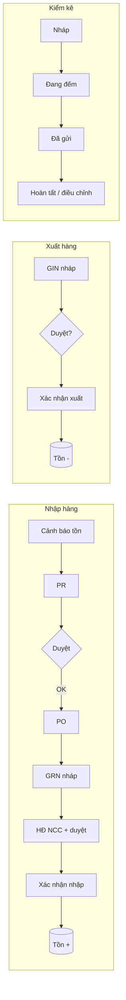

# Frezo Warehouse — Benchmark thị trường & quyết định adopt

> Brief BA (2026-07) — tham chiếu trước khi mở rộng module Kho.  
> Nguồn: AMIS Kho, Fast, Odoo, SAP B1, Sapo/KiotViet/Haravan, Base WMS, 1Office, Getfly, Nhanh.vn.

---

## 1. Ma trận so sánh (8 sản phẩm)

| Tính năng | AMIS Kho | Fast Accounting | Odoo Inventory | SAP B1 | Sapo / KiotViet | Base WMS | 1Office | Getfly |
|-----------|:--------:|:---------------:|:--------------:|:------:|:---------------:|:--------:|:-------:|:------:|
| **PR → PO → GRN** | ✅ Workflow + AMIS Mua hàng | ✅ Mua hàng → nhập kho | ✅ RFQ → PO → Receipt | ✅ PR → PO → GRPO → AP Invoice | ⚠️ Đặt hàng nhập → nhập hàng (đơn giản) | ⚠️ Receipt từ PO | ✅ Mua hàng tích hợp | ✅ Yêu cầu nhập + duyệt |
| **GRN block HĐ NCC** | ✅ AI đọc BB giao hàng | ✅ Hạch toán GTGT đầu vào | ⚠️ Bill sau receipt | ✅ GRPO ↔ AP Invoice khớp | ⚠️ Thanh toán công nợ NCC | ❌ | ⚠️ Thu chi liên kết | ⚠️ Giá vốn BQ |
| **GIN loại** | ✅ Nhiều bước xuất | ✅ Xuất bán / điều chuyển / SX | ✅ Delivery / Internal / Pick-Pack | ✅ Delivery + transfer | ✅ Bán tự trừ kho | ✅ Pick / Ship / Internal | ✅ Xuất + chuyển | ✅ Xuất + duyệt |
| **Multi-warehouse** | ✅ Đa kho + vị trí | ✅ Không giới hạn kho | ✅ Routes đa bước | ✅ | ✅ Chi nhánh / đa kho | ✅ Catalog đa kho | ✅ Mạng lưới kho | ✅ Theo kho |
| **Reorder / cảnh báo** | ✅ AI dự báo nhập | ✅ Định mức tồn | ✅ Reordering rules | ✅ Min inventory | ✅ Min + cảnh báo | ✅ Replenishment | ✅ Min/max alert | ⚠️ Báo cáo tồn |
| **Stock take** | ✅ Lô/HSD/vị trí → auto PNK/PXK | ✅ Kiểm kê → điều chỉnh | ✅ Cycle count + barcode | ✅ Inventory counting | ✅ App kiểm kho barcode | ✅ Full/partial + scan | ✅ Kiểm kê định kỳ | ⚠️ Cơ bản |
| **Barcode** | ✅ Mobile + scan | ⚠️ Import Excel | ✅ Barcode app mạnh | ⚠️ Add-on | ✅ KiotViet/Sapo app | ✅ Scan-first WMS | ❌ | ❌ |
| **Approval** | ✅ Duyệt lệnh nhập/xuất nhiều bước | ⚠️ Phân quyền vai trò | ⚠️ Theo route | ✅ Authorization | ❌ | ⚠️ | ✅ Quy trình thu chi/mua | ✅ Duyệt kho CRM |
| **Báo cáo XNT** | ✅ Lô, vị trí, FEFO | ✅ ABC, tuổi tồn | ✅ Valuation reports | ✅ Inventory reports | ✅ XNT theo kênh | ✅ Turnover, ABC | ✅ Lịch sử GD | ✅ Bảng XNT + giá vốn |

**Điểm mạnh EU dùng hàng ngày (rút gọn):**

| Sản phẩm | Thủ kho thích vì… |
|----------|-------------------|
| **AMIS Kho** | Pipeline lệnh nhập/xuất nhiều bước, AI đọc BB giao hàng, FIFO/FEFO |
| **Fast** | Phân quyền kho không thấy giá, tính giá nhanh, import Excel |
| **Odoo** | Barcode scan tại sàn kho, PO→Receipt 1 click |
| **SAP B1** | GRPO ↔ Hóa đơn NCC khớp số liệu, audit rõ |
| **Sapo/KiotViet** | Tự trừ kho khi bán, cảnh báo min, kiểm kho mobile |
| **Base WMS** | Scan-first, chặn tồn âm, kiểm kê có chứng từ |
| **1Office** | Tích hợp mua–kho–thu chi một luồng SME |
| **Getfly** | Duyệt xuất/nhập trong CRM, KD xem tồn không hỏi KT |

---

## 2. Gap Frezo hiện tại (audit code)

| Hạng mục | Trạng thái | Ghi chú |
|----------|------------|---------|
| PR → Approval → PO → GRN | ✅ Có pipeline FE | PR detail có stepper; PO có "Nhận hàng → GRN" |
| GRN approval + HĐ NCC | ⚠️ BE có submit/approve; FE thiếu | Trước adapt: GRN detail confirm thẳng từ DRAFT |
| GIN approval pipeline | ✅ Align AMIS/Getfly | Submit → Duyệt → Confirm |
| Kiểm kê 4 bước | ✅ Align Odoo/AMIS | Draft → Đếm → Gửi → Posted |
| Reorder + Alert → PR | ✅ Unique Frezo | Multi-select alert cùng NCC |
| Dashboard KPI kho | ❌ Thiếu | Đối thủ đều có màn tổng quan |
| Barcode / vị trí / lô | ❌ Chưa (P2) | BE có batch field, chưa UX scan |
| Trùng lặp code | ⚠️ PR detail dùng STATUS riêng | Nên gom `warehouseStatus.ts` |
| Thừa / chưa dùng | `POSTED`/`DONE` doc status | Ít dùng trên GRN/GIN thực tế |

---

## 3. Frezo adopt gì?

### P0 (sprint này — đã implement)

- **Workflow chuẩn mua hàng:** Alert → PR → Duyệt → PO → GRN (HĐ NCC bắt buộc khi có NCC/PO) → Confirm → tồn
- **GRN pipeline FE:** Nháp → Gửi duyệt → Duyệt → Xác nhận nhập (khớp BE + AMIS/SAP pattern)
- **GIN 3 loại chính:** Xuất bán / Chuyển kho nội bộ / Xuất nội bộ (label EU)
- **Dashboard `/warehouse`:** KPI nháp/chờ duyệt/cảnh báo + shortcut luồng
- **EU guide** cập nhật `guide-warehouse-grn-gin.md`

### P1 (sprint sau)

- Barcode scan (mobile hoặc input scan) trên GRN confirm / stock take
- Báo cáo XNT tổng hợp (theo kho, SP, kỳ)
- Gom badge/status PR detail → shared `warehouseStatus`
- Vị trí kho / zone (AMIS/Base)
- Liên kết GRN → module Kế toán (hạch toán GTGT đầu vào)
- GRN từ PO: auto-fill NCC + dòng hàng còn thiếu

### P2 (backlog)

- Multi-step receipt (Input → Stock) như Odoo 2-step
- AI đọc BB giao hàng (AMIS)
- FIFO/FEFO pick policy
- Tích hợp đa kênh (Haravan pattern) nếu Frezo mở TMĐT

---

## 4. Workflow Frezo sau adapt

---

## 5. Quyết định thiết kế (voice BA)

1. **Tồn chỉ đổi ở Confirm** — giữ nguyên, khớp Odoo/SAP/Fast (DRAFT không ảnh hưởng sổ).
2. **HĐ NCC trên GRN** — bắt buộc khi phiếu gắn NCC hoặc PO (pattern SAP GRPO ↔ AP Invoice, AMIS GTGT đầu vào).
3. **Duyệt GRN/GIN** — optional per org: có thể Confirm thẳng từ DRAFT (SME nhỏ), nhưng UI luôn hiện pipeline để scale.
4. **Không copy UI AMIS** — Frezo giữ shell list/detail + stepper ngang; không làm "lệnh nhập kho" riêng tách PNK.

---

*Tài liệu nội bộ module — cập nhật khi sprint P1.*
