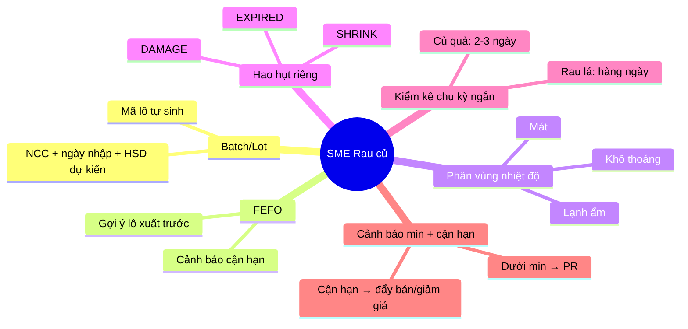
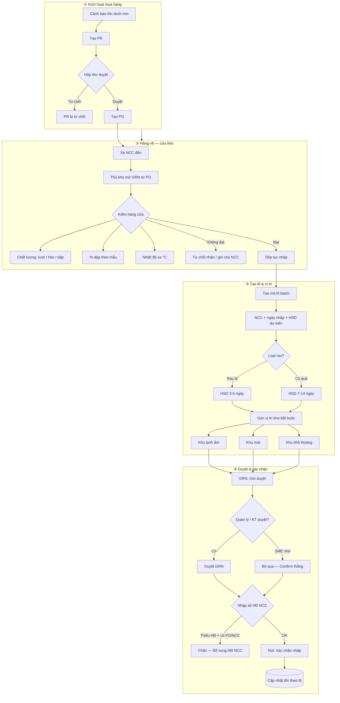
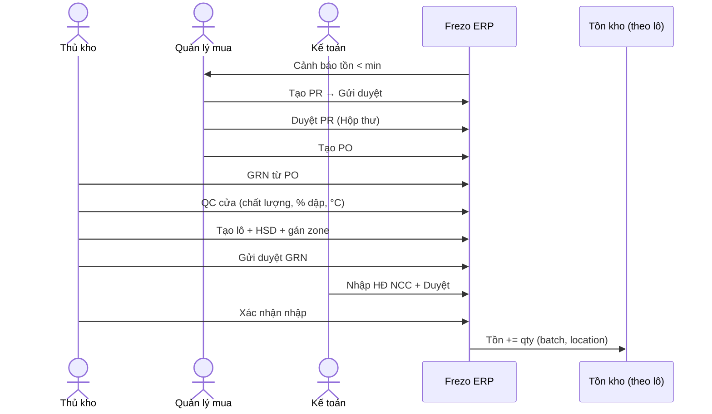
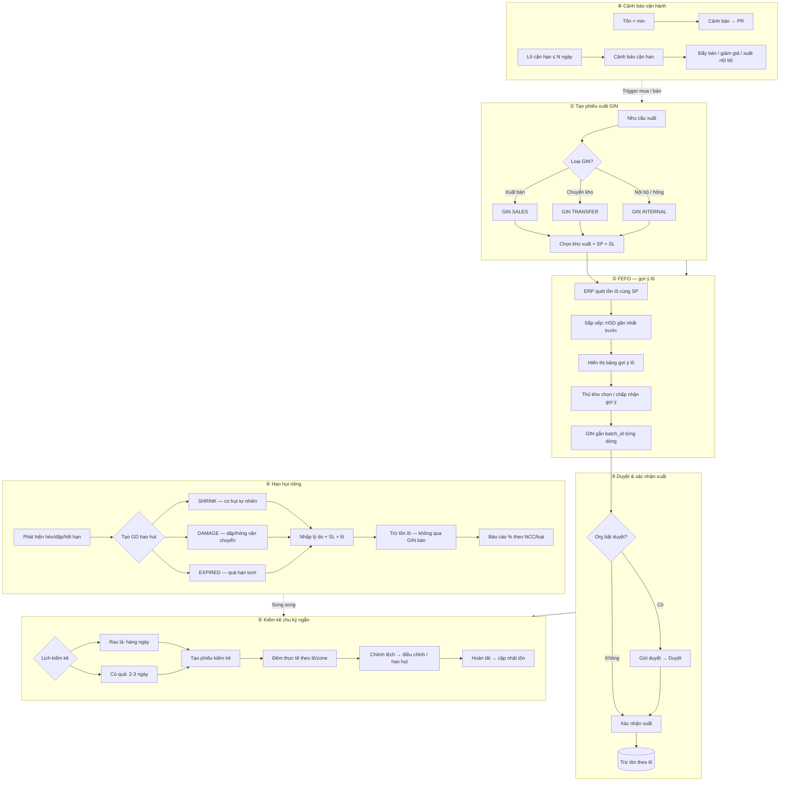
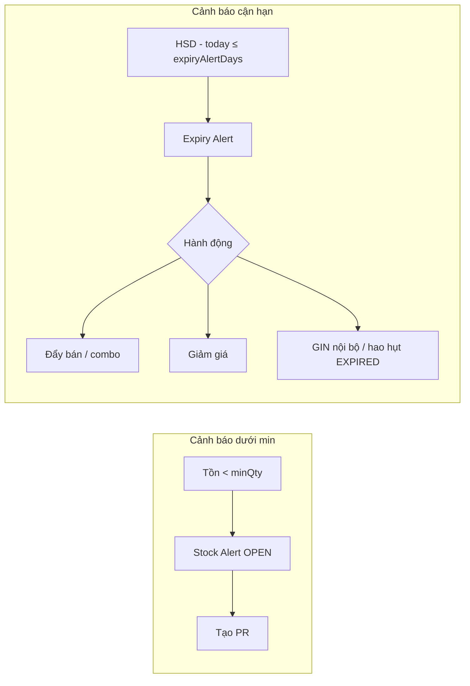
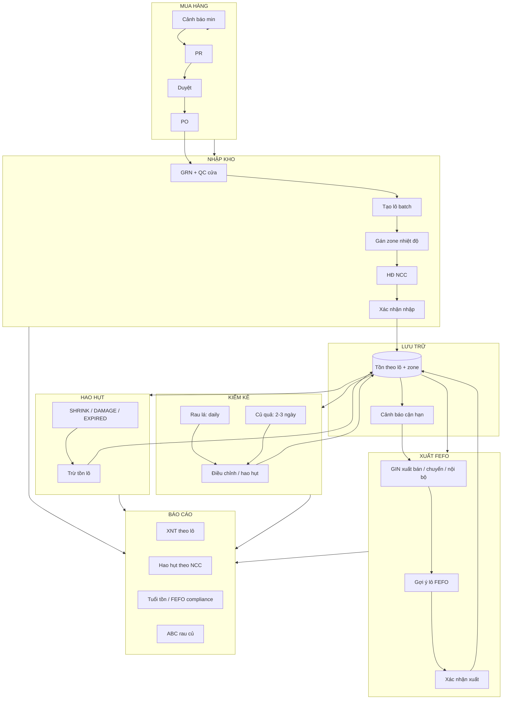
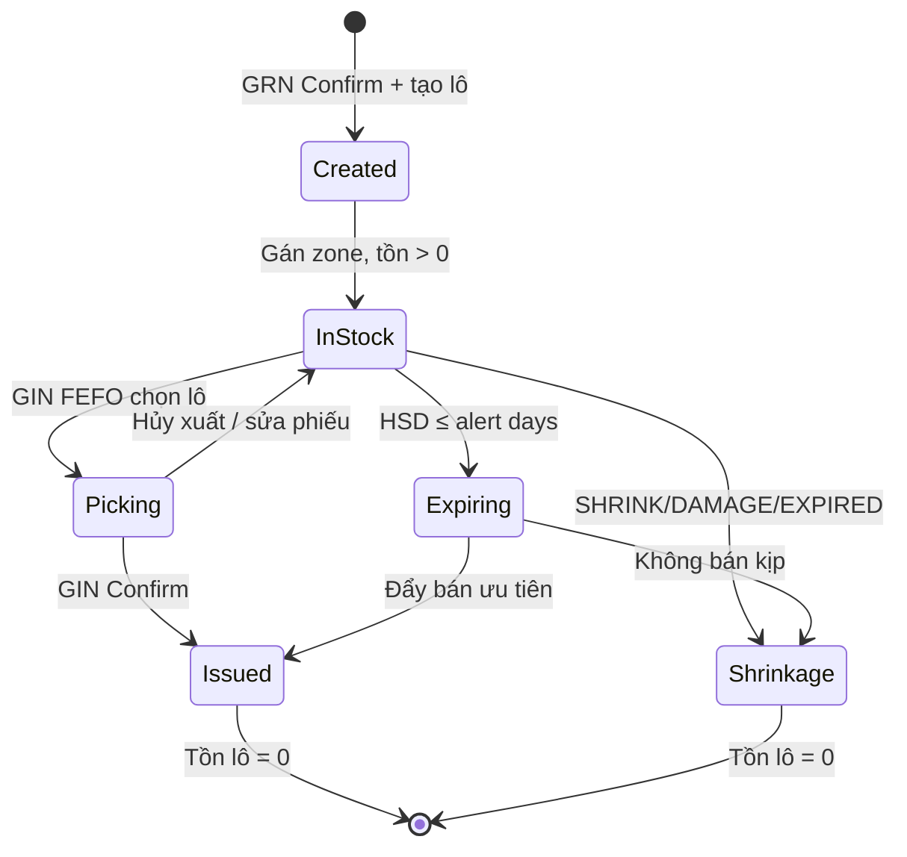

# Frezo Warehouse — Workflow SME Rau củ quả

> **Tài liệu BA nội bộ module Kho** · Phân khúc: SME phân phối rau củ tươi · Cập nhật: 2026-07-29  
> Tham chiếu: [WAREHOUSE_BENCHMARK.md](./WAREHOUSE_BENCHMARK.md) · Giọng BA/EU theo `ba-srs.mdc`

---

## Mục lục

1. [Context SME rau củ](#1-context-sme-rau-củ)
2. [Luồng 1 — Nhập kho](#2-luồng-1--nhập-kho)
3. [Luồng 2 — Xuất kho & kiểm soát hao hụt](#3-luồng-2--xuất-kho--kiểm-soát-hao-hụt)
4. [Sơ đồ tổng thể end-to-end](#4-sơ-đồ-tổng-thể-end-to-end)
5. [Ma trận Frezo: Có / Thiếu / Sprint](#5-ma-trận-frezo-có--thiếu--sprint)
6. [Gợi ý DB (tóm tắt BA)](#6-gợi-ý-db-tóm-tắt-ba)
7. [Mockup text màn hình](#7-mockup-text-màn-hình)

---

## 1. Context SME rau củ

### 1.1 Bối cảnh vận hành

| Yếu tố | Đặc thù nghiệp vụ | Hệ quả lên ERP |
|--------|-------------------|----------------|
| **Hàng tươi sống** | Không bảo quản lâu; chất lượng giảm theo giờ/ngày | Bắt buộc quản lý **lô (batch)** + **hạn tươi dự kiến** |
| **Hạn ngắn** | Rau lá 3–5 ngày; củ quả 7–14 ngày | Chính sách **FEFO** (First Expired, First Out) khi xuất |
| **Hao hụt cao** | Dập, héo, thối, sượt vận chuyển 5–15% | Giao dịch **hao hụt riêng** (SHRINK / DAMAGE / EXPIRED), không trộn vào xuất bán |
| **Nhiều NCC vùng miền** | Đà Lạt, Hà Nội, ĐBSCL… chất lượng & % hao khác nhau | Lô gắn **NCC + vùng**; báo cáo hao hụt theo NCC/loại |
| **Multi-warehouse** | Kho HN / HCM / ĐL; chuyển kho nội bộ thường xuyên | Tồn theo **kho + zone nhiệt độ**; GIN chuyển kho có deadline FEFO |
| **Kiểm kê dày** | Rau lá đếm hàng ngày; củ quả 2–3 ngày/lần | Chu kỳ kiểm kê ngắn, ưu tiên lô cận hạn |

### 1.2 Actor & quyền (gợi ý)

| Vai trò | Trách nhiệm chính | Màn hình thường dùng |
|---------|-------------------|----------------------|
| **Thủ kho** | Kiểm hàng cửa, tạo lô, gán vị trí, xuất FEFO, ghi hao hụt, kiểm kê | GRN, GIN, Kiểm kê, Cảnh báo |
| **Quản lý mua hàng** | Duyệt PR, đặt PO, theo dõi NCC | Cảnh báo → PR → PO |
| **Kế toán** | HĐ NCC trên GRN, đối chiếu giá vốn, báo cáo hao hụt | GRN (HĐ NCC), Báo cáo XNT |
| **Kinh doanh / Giao hàng** | Tạo GIN xuất bán, nhận gợi ý lô cận hạn | GIN xuất bán |

### 1.3 Sáu điểm mấu chốt (must-have)



---

## 2. Luồng 1 — Nhập kho

### 2.1 Tổng quan luồng



### 2.2 Chi tiết từng bước (EU)

#### Bước 1 — Cảnh báo tồn → PR

| # | Hành động EU | Nút UI gợi ý | Ghi chú |
|---|--------------|--------------|---------|
| 1.1 | Hệ thống quét tồn < min (theo quy tắc tái nhập) | — | Alert OPEN trên `/warehouse/stock-alerts` |
| 1.2 | Thủ kho / Mua chọn alert cùng NCC | **Tạo PR từ cảnh báo** | Frezo unique: multi-select alert |
| 1.3 | Điền SL đề xuất, lý do, kho đích | **Lưu nháp** / **Gửi duyệt** | PR gắn `warehouseId` + `supplierId` |
| 1.4 | Quản lý duyệt tại Hộp thư | **Duyệt** / **Từ chối** | Duyệt PR **không** tăng tồn |

#### Bước 2 — PR duyệt → PO

| # | Hành động EU | Nút UI gợi ý | Ghi chú |
|---|--------------|--------------|---------|
| 2.1 | Mua tạo PO từ PR đã duyệt | **Tạo PO** | Auto-fill dòng hàng, NCC, kho |
| 2.2 | Gửi PO cho NCC (ngoài hệ thống) | **Xác nhận đặt hàng** | Trạng thái PO: Đã đặt |
| 2.3 | NCC giao hàng theo lịch | — | PO có `expectedDeliveryDate` |

#### Bước 3 — Hàng về → GRN nháp

| # | Hành động EU | Nút UI gợi ý | Ghi chú |
|---|--------------|--------------|---------|
| 3.1 | Thủ kho mở PO → **Nhận hàng → GRN** | **Tạo GRN từ PO** | Auto-fill NCC, kho, dòng còn thiếu |
| 3.2 | **Kiểm hàng tại cửa** (QC gate) | Panel **Kiểm tra đầu vào** | Bắt buộc trước khi tạo lô |

**Tiêu chí kiểm cửa (gợi ý form):**

| Trường | Kiểu | Validation |
|--------|------|------------|
| Chất lượng tổng thể | Select: Đạt / Chấp nhận có điều kiện / Không đạt | Không đạt → chặn Confirm |
| % dập / hư hỏng | Number 0–100% | > ngưỡng NCC → cảnh báo, ghi ảnh |
| Nhiệt độ xe (°C) | Number | Rau lá: ≤ 8°C; củ quả: ≤ 12°C (cấu hình theo SP) |
| Ghi chú QC | Text | Audit trail |

#### Bước 4 — Tạo mã lô (batch)

| # | Hành động EU | Nút UI gợi ý | Ghi chú |
|---|--------------|--------------|---------|
| 4.1 | Mỗi dòng GRN → **Tạo lô mới** hoặc chọn lô có sẵn | **+ Tạo lô** | Mã auto: `{SP}-{NCC}-{YYYYMMDD}-{seq}` |
| 4.2 | Hệ thống gợi ý HSD dự kiến theo loại SP | Field **Hạn tươi dự kiến** | Rau lá: +3~5 ngày; Củ quả: +7~14 ngày |
| 4.3 | Gắn NCC, ngày nhập, số lượng thực nhận | **Lưu dòng** | `qtyReceived` có thể ≠ `qtyExpected` |

**Quy tắc sinh mã lô (BA spec):**

```
LOT-{productCode}-{supplierCode}-{YYYYMMDD}-{001}
Ví dụ: LOT-RAU001-DALAT-20260729-001
```

#### Bước 5 — Gán vị trí kho (bắt buộc)

| # | Hành động EU | Nút UI gợi ý | Ghi chú |
|---|--------------|--------------|---------|
| 5.1 | Chọn **khu vực nhiệt độ** theo master SP | Dropdown **Vị trí / Zone** | Bắt buộc trước Confirm |
| 5.2 | Hệ thống validate SP ↔ zone | — | VD: Rau muống → chỉ **Lạnh ẩm** |

**Ma trận zone mẫu:**

| Zone | Nhiệt độ | Loại rau củ phù hợp |
|------|----------|---------------------|
| **Lạnh ẩm** | 2–8°C, RH 85–95% | Rau lá, rau ăn sống, dưa leo |
| **Mát** | 8–15°C | Cà chua, ớt, trái cây mềm |
| **Khô thoáng** | 15–25°C, thông gió | Củ, gừng, tỏi, khoai |

#### Bước 6 — HĐ NCC → Xác nhận nhập

| # | Hành động EU | Nút UI gợi ý | Ghi chú |
|---|--------------|--------------|---------|
| 6.1 | GRN gắn PO/NCC → nhập **Số HĐ GTGT đầu vào** | Field **Số HĐ NCC** | Block Confirm nếu thiếu (pattern SAP) |
| 6.2 | (Tuỳ org) Gửi duyệt → Duyệt | **Gửi duyệt** → **Duyệt** | SME nhỏ có thể Confirm thẳng DRAFT |
| 6.3 | Thủ kho bấm xác nhận | **Xác nhận nhập** | **Chỉ bước này** tăng tồn |
| 6.4 | Hệ thống cập nhật tồn theo lô + vị trí | — | `stock_balance` += qty theo `batch_id` |

### 2.3 Sequence diagram — Nhập kho



---

## 3. Luồng 2 — Xuất kho & kiểm soát hao hụt

### 3.1 Tổng quan luồng



### 3.2 Chi tiết từng bước (EU)

#### Bước 1 — Tạo GIN

| # | Loại GIN | Mục đích | Actor |
|---|----------|----------|-------|
| 1.1 | **Xuất bán** | Giao cho khách / đơn CRM | KD / Thủ kho |
| 1.2 | **Chuyển kho nội bộ** | HN → HCM, ĐL → HN | Thủ kho |
| 1.3 | **Xuất nội bộ** | Tiêu hao, mẫu, tặng | Thủ kho |

**Nút UI:** **Tạo phiếu xuất** → chọn loại → **Lưu nháp**

#### Bước 2 — FEFO: gợi ý lô xuất

| # | Hành động EU | Nút UI gợi ý | Ghi chú |
|---|--------------|--------------|---------|
| 2.1 | Thêm dòng SP + SL cần xuất | **+ Thêm dòng** | |
| 2.2 | ERP liệt kê lô có tồn, sort **HSD asc** | Panel **Gợi ý FEFO** | Highlight lô cận hạn đỏ/vàng |
| 2.3 | Thủ kho **Chấp nhận gợi ý** hoặc chọn lô khác | **Áp dụng FEFO** | Override cần lý do (audit) |
| 2.4 | Mỗi dòng GIN bắt buộc `batch_id` | Column **Mã lô** | Không cho Confirm nếu thiếu lô (rau củ) |

**Ví dụ bảng gợi ý FEFO:**

| Mã lô | NCC | HSD dự kiến | Tồn lô | Gợi ý xuất | Cảnh báo |
|-------|-----|-------------|--------|------------|----------|
| LOT-R001-DL-0727-001 | NCC ĐL | 30/07 | 50 kg | **50 kg** | Cận hạn 1 ngày |
| LOT-R001-DL-0728-002 | NCC ĐL | 02/08 | 80 kg | 0 kg | — |

#### Bước 3 — Xác nhận xuất → trừ tồn lô

| # | Hành động EU | Nút UI gợi ý | Ghi chú |
|---|--------------|--------------|---------|
| 3.1 | Pipeline: Nháp → (Duyệt) → Xác nhận | **Xác nhận xuất** | Chỉ Confirm mới trừ tồn |
| 3.2 | Trừ `stock_balance` theo `batch_id` | — | Chặn tồn âm theo lô |
| 3.3 | Ghi audit: ai xuất, lô nào, lúc nào | Tab **Lịch sử** | |

#### Bước 4 — Hao hụt riêng (SHRINK / DAMAGE / EXPIRED)

| Mã GD | Tên EU | Khi nào dùng | Ảnh hưởng tồn |
|-------|--------|--------------|---------------|
| **SHRINK** | Co hụt / mất nước | Cân lại thấy thiếu, không xác định nguyên nhân | Trừ lô, không doanh thu |
| **DAMAGE** | Hư hỏng / dập | Vận chuyển, bốc xếp, QC phát hiện | Trừ lô; có thể claim NCC |
| **EXPIRED** | Quá hạn tươi | HSD qua, không bán được | Trừ lô; báo cáo hao hụt |

| # | Hành động EU | Nút UI gợi ý | Ghi chú |
|---|--------------|--------------|---------|
| 4.1 | Tạo phiếu hao hụt từ lô / kiểm kê | **Ghi hao hụt** | Route riêng, không lẫn GIN bán |
| 4.2 | Chọn mã GD + lý do + SL | **Lưu & trừ tồn** | % hao tính theo NCC/loại SP |
| 4.3 | Kế toán xem báo cáo hao hụt kỳ | **Xuất Excel** | So sánh benchmark NCC |

#### Bước 5 — Kiểm kê chu kỳ ngắn

| Loại SP | Chu kỳ đề xuất | Phạm vi đếm | Ưu tiên |
|---------|----------------|-------------|---------|
| Rau lá | **Hàng ngày** | Toàn bộ lô rau lá + zone lạnh ẩm | Lô cận hạn trước |
| Củ quả | **2–3 ngày** | Theo zone mát/khô | SP tồn cao, biến động lớn |

**Luồng Frezo hiện có (4 bước):** Nháp → Đang đếm → Đã gửi → Hoàn tất

| # | Hành động EU | Nút UI gợi ý | Ghi chú |
|---|--------------|--------------|---------|
| 5.1 | Tạo phiếu kiểm kê theo kho/zone | **Tạo kiểm kê** | Filter: zone, category |
| 5.2 | Đếm thực tế từng lô | **Nhập SL đếm** | Mobile/scan (P1) |
| 5.3 | Chênh lệch âm → tạo hao hụt hoặc điều chỉnh | **Tạo hao hụt từ chênh lệch** | Link shrinkage_transaction |
| 5.4 | Hoàn tất | **Hoàn tất kiểm kê** | Cập nhật tồn sổ |

#### Bước 6 — Cảnh báo min & cận hạn



| Cảnh báo | Nguồn dữ liệu | Hành động EU gợi ý |
|----------|---------------|-------------------|
| **Dưới min** | `reorder_rule.minQty` vs tồn hiện tại | Tạo PR → PO → GRN |
| **Cận hạn** | `batch.expected_expiry_date` vs `product.expiryAlertDays` | Ưu tiên FEFO; KD giảm giá; alert dashboard |

---

## 4. Sơ đồ tổng thể end-to-end



### 4.1 Vòng đời lô (batch lifecycle)



---

## 5. Ma trận Frezo: Có / Thiếu / Sprint

> Audit dựa trên [WAREHOUSE_BENCHMARK.md](./WAREHOUSE_BENCHMARK.md) và code FE/BE hiện tại (2026-07).

| Nghiệp vụ | Frezo hiện tại | Gap | Sprint đề xuất |
|-----------|----------------|-----|----------------|
| Cảnh báo tồn dưới min | ✅ `stock-alerts`, severity, multi-PR | — | **Đã có (P0)** |
| PR → Duyệt → PO | ✅ Pipeline FE + Hộp thư | PR detail status chưa gom shared | P1 — refactor `warehouseStatus` |
| GRN từ PO | ✅ Nút "Nhận hàng → GRN" | Auto-fill dòng thiếu chưa đủ | P1 |
| GRN pipeline (Nháp → Duyệt → Confirm) | ✅ BE + stepper FE | FE trước đây Confirm thẳng DRAFT | **P0 done** |
| Block HĐ NCC trước Confirm | ⚠️ BE validate; FE đang bổ sung | UX chặn rõ + copy EU | **P0 — FE** |
| Kiểm hàng QC cửa (% dập, °C) | ❌ Chưa | Form QC gate trên GRN | **P1 — SME rau củ** |
| Tạo mã lô (batch) khi nhập | ⚠️ BE field `batchId`/`batchCode` trên GRN item | UX tạo lô + HSD dự kiến | **P1 — SME rau củ** |
| Gán vị trí / zone nhiệt độ | ⚠️ BE `locationId`; chưa master zone | Seed zone + validate SP↔zone | **P1** |
| Cập nhật tồn theo lô khi Confirm GRN | ⚠️ BE có batch; tồn aggregate chưa rõ theo lô | `stock_balance` by batch | **P1 — SA+BE** |
| GIN 3 loại (bán / chuyển / nội bộ) | ✅ Label EU | — | **P0 done** |
| GIN pipeline duyệt | ✅ Submit → Approve → Confirm | — | **P0 done** |
| FEFO gợi ý lô xuất | ❌ Chưa | Sort batch by expiry + UI gợi ý | **P1 — SME rau củ** |
| Xuất bắt buộc theo lô | ⚠️ API có `batchId` | Validation + UI column lô | **P1** |
| Hao hụt riêng SHRINK/DAMAGE/EXPIRED | ❌ Chưa | Entity `shrinkage_transaction` | **P1 — SME rau củ** |
| Kiểm kê 4 bước | ✅ Draft → Count → Submit → Posted | Chưa filter zone / lô | P1 |
| Kiểm kê chu kỳ ngắn (daily rau lá) | ❌ Chưa lịch auto | Scheduler + reminder | **P2** |
| Cảnh báo cận hạn (expiry alert) | ⚠️ SP có `expiryAlertDays` | Alert theo **lô**, dashboard | **P1 — SME rau củ** |
| Multi-warehouse HN/HCM/ĐL | ✅ Chọn kho trên GRN/GIN | Báo cáo XNT đa kho | P1 |
| Reorder rules min/max | ✅ `/warehouse/reorder-rules` | — | **P0 done** |
| Dashboard kho KPI | ✅ `/warehouse` | Thiếu KPI hao hụt, cận hạn | P1 |
| Barcode scan GRN / kiểm kê | ❌ | Mobile scan | P2 |
| Báo cáo XNT theo lô | ❌ | Report module | P1 |
| Báo cáo hao hụt theo NCC | ❌ | Report module | P1 |

### 5.1 Roadmap tóm tắt cho SME rau củ

| Sprint | Phạm vi | FR-ID gợi ý |
|--------|---------|-------------|
| **P0** (done) | PR→PO→GRN→GIN pipeline, alert→PR, dashboard | FR-WH-01..05 |
| **P1** (tiếp theo) | Batch/lot UX, zone, FEFO, hao hụt, expiry alert | FR-WH-10..16 |
| **P2** (backlog) | Barcode, kiểm kê auto-schedule, AI QC | FR-WH-20..22 |

---

## 6. Gợi ý DB (tóm tắt BA)

> **Không implement** — chỉ mô tả entity cho SA thiết kế contract.

### 6.1 ERD tóm tắt

```mermaid
erDiagram
  WAREHOUSE ||--o{ WAREHOUSE_LOCATION : has
  WAREHOUSE_LOCATION }o--|| TEMPERATURE_ZONE : belongs_to
  PRODUCT ||--o{ INVENTORY_BATCH : stocked_as
  SUPPLIER ||--o{ INVENTORY_BATCH : supplies
  INVENTORY_BATCH ||--o{ STOCK_BALANCE : quantity
  WAREHOUSE_LOCATION ||--o{ STOCK_BALANCE : stores
  GRN ||--o{ GRN_ITEM : contains
  GRN_ITEM }o--o| INVENTORY_BATCH : creates
  GIN ||--o{ GIN_ITEM : contains
  GIN_ITEM }o--|| INVENTORY_BATCH : issues_from
  SHRINKAGE_TRANSACTION }o--|| INVENTORY_BATCH : reduces
  EXPIRY_ALERT }o--|| INVENTORY_BATCH : warns

  INVENTORY_BATCH {
    uuid id PK
    string batch_code UK
    uuid product_id FK
    uuid supplier_id FK
    uuid warehouse_id FK
    date received_date
    date expected_expiry_date
    decimal qty_received
    decimal qty_on_hand
    string status
  }

  WAREHOUSE_LOCATION {
    uuid id PK
    uuid warehouse_id FK
    string location_code
    uuid zone_id FK
    boolean active
  }

  TEMPERATURE_ZONE {
    uuid id PK
    string code
    string name
    decimal temp_min_c
    decimal temp_max_c
    decimal humidity_min_pct
  }

  STOCK_BALANCE {
    uuid id PK
    uuid batch_id FK
    uuid location_id FK
    decimal quantity
  }

  SHRINKAGE_TRANSACTION {
    uuid id PK
    string transaction_code
    enum type SHRINK_DAMAGE_EXPIRED
    uuid batch_id FK
    decimal quantity
    string reason_code
    string reason_note
    uuid created_by FK
    timestamp created_at
  }

  EXPIRY_ALERT {
    uuid id PK
    uuid batch_id FK
    int days_to_expiry
    enum severity
    enum status OPEN_RESOLVED
    timestamp triggered_at
  }
```

### 6.2 Bảng chính — mô tả cột

#### `inventory_batch`

| Cột | Kiểu | Mô tả |
|-----|------|-------|
| `batch_code` | VARCHAR | Mã lô hiển thị EU: `LOT-{SP}-{NCC}-{date}-{seq}` |
| `product_id` | UUID FK | Sản phẩm |
| `supplier_id` | UUID FK | NCC giao lô |
| `warehouse_id` | UUID FK | Kho nhập |
| `grn_item_id` | UUID FK | Dòng GRN tạo lô |
| `received_date` | DATE | Ngày nhập kho |
| `expected_expiry_date` | DATE | HSD dự kiến (FEFO key) |
| `qty_received` | DECIMAL | SL nhập ban đầu |
| `qty_on_hand` | DECIMAL | SL còn (denormalized, sync từ balance) |
| `qc_damage_pct` | DECIMAL | % dập ghi nhận lúc QC cửa |
| `status` | ENUM | ACTIVE / DEPLETED / EXPIRED |

#### `warehouse_location` + `temperature_zone`

| Entity | Mục đích |
|--------|----------|
| `temperature_zone` | Master: Lạnh ẩm / Mát / Khô — nhiệt độ, độ ẩm |
| `warehouse_location` | Vị trí cụ thể trong kho, gắn 1 zone |
| `product_zone_rule` | (Optional) SP chỉ được phép zone nào |

#### `shrinkage_transaction`

| Cột | Kiểu | Mô tả |
|-----|------|-------|
| `type` | ENUM | `SHRINK` / `DAMAGE` / `EXPIRED` |
| `batch_id` | UUID FK | Lô bị hao hụt |
| `quantity` | DECIMAL | SL hao hụt |
| `reason_code` | VARCHAR | Mã lý do chuẩn hoá |
| `reason_note` | TEXT | Ghi chú thủ kho |
| `stock_take_id` | UUID FK | (Optional) Link kiểm kê |

#### `expiry_alert`

| Cột | Kiểu | Mô tả |
|-----|------|-------|
| `batch_id` | UUID FK | Lô cận hạn |
| `days_to_expiry` | INT | Số ngày còn lại khi trigger |
| `severity` | ENUM | WARNING (< 2 ngày) / CRITICAL (< 1 ngày) |
| `status` | ENUM | OPEN / DISMISSED / RESOLVED |
| `suggested_action` | VARCHAR | FEFO / DISCOUNT / WRITE_OFF |

### 6.3 Quy tắc nghiệp vụ DB

1. **Tồn chỉ đổi tại Confirm** — GRN Confirm (+), GIN Confirm (−), Shrinkage Post (−), Stock take Posted (±).
2. **Không tồn âm theo lô** — constraint `qty_on_hand >= 0`.
3. **FEFO** — index `(product_id, expected_expiry_date ASC)` trên `inventory_batch` where `qty_on_hand > 0`.
4. **Expiry alert job** — chạy nightly: `expected_expiry_date - today <= product.expiry_alert_days`.

---

## 7. Mockup text màn hình

> Mockup text theo chuẩn FE UI — route, fields, validation, 1 primary action. Không phải wireframe pixel.

---

### 7.1 Màn hình 1 — Nhập kho + tạo lô

**Route:** `/warehouse/grn/:id` (tab **Chi tiết** + panel **Lô & vị trí**)

**Header**

```
Phiếu nhập kho GRN-20260729-0042          [Nháp ▾]
PO: PO-20260728-0015 · NCC: Rau Đà Lạt Xanh · Kho: HCM-01
Stepper: Nháp → Gửi duyệt → Duyệt → Xác nhận nhập
```

**Panel A — Kiểm tra đầu vào (QC cửa)** *(expand, bắt buộc trước Confirm)*

| Field | Loại | Validation | Placeholder |
|-------|------|------------|-------------|
| Chất lượng tổng thể | Select | Required | Đạt / Chấp nhận có ĐK / Không đạt |
| % dập trung bình | Number | 0–100 | VD: 3 |
| Nhiệt độ xe (°C) | Number | Required | VD: 6 |
| Ghi chú QC | Textarea | Max 500 | Ghi nhận tình trạng pallet… |
| Ảnh kiểm hàng | Upload | Optional, max 5 | — |

**Primary (panel A):** `Lưu QC`

**Panel B — Dòng hàng & lô**

| Cột | Nội dung |
|-----|----------|
| Sản phẩm | Rau muống — bó 500g |
| SL dự kiến | 200 bó |
| SL thực nhận | `[200]` editable |
| **Mã lô** | `[+ Tạo lô]` → `LOT-RM001-DLX-20260729-001` |
| **HSD dự kiến** | `[02/08/2026]` auto +3 ngày, editable |
| **Vị trí / Zone** | `[▼ Lạnh ẩm — Kệ A-03]` **required** |
| Đơn giá | 8.500 ₫ |

**Footer actions**

```
[Gửi duyệt]   [Hủy phiếu]
Primary: [Xác nhận nhập]  ← disabled nếu: thiếu HĐ NCC | thiếu lô | thiếu zone | QC chưa lưu
```

**Empty state (chưa có dòng):**  
*"Chưa có dòng hàng. Bấm **Thêm từ PO** hoặc **Thêm dòng** để bắt đầu kiểm hàng."*

**Error copy**

- Thiếu HĐ NCC: *"Phiếu gắn NCC/PO cần **Số HĐ GTGT đầu vào** trước khi xác nhận nhập."*
- Thiếu zone: *"Mỗi dòng cần **Vị trí kho** — rau lá bắt buộc khu Lạnh ẩm."*

---

### 7.2 Màn hình 2 — Xuất FEFO (gợi ý lô)

**Route:** `/warehouse/gin/:id` (loại: **Xuất bán**)

**Header**

```
Phiếu xuất kho GIN-20260729-0088          [Nháp ▾]
Loại: Xuất bán · Kho xuất: HCM-01 · Khách: NT Miền Nam
```

**Panel — Dòng xuất + FEFO**

```
Sản phẩm: [▼ Rau muống — bó 500g]
SL cần xuất: [80] bó

┌─ Gợi ý FEFO (hạn gần nhất trước) ────────────────────────────────┐
│ ⚠ Lô cận hạn được ưu tiên                                          │
│ [✓ Áp dụng gợi ý FEFO]                                              │
├──────────┬─────────┬────────────┬────────┬───────────┬─────────────┤
│ Chọn     │ Mã lô   │ HSD        │ Tồn lô │ Gợi ý SL  │ Cảnh báo    │
├──────────┼─────────┼────────────┼────────┼───────────┼─────────────┤
│ [✓]      │ LOT-…01 │ 30/07/2026 │ 50     │ 50        │ 🔴 1 ngày   │
│ [✓]      │ LOT-…02 │ 02/08/2026 │ 80     │ 30        │ —           │
└──────────┴─────────┴────────────┴────────┴───────────┴─────────────┘
Tổng đã phân bổ: 80 / 80 bó ✓
```

**Override lô (modal)**

| Field | Validation |
|-------|------------|
| Lý do chọn lô khác FEFO | Required nếu không chọn lô gợi ý đầu |
| Ghi chú | Optional |

**Primary:** `Xác nhận xuất`  
**Secondary:** `Gửi duyệt` · `Lưu nháp`

**Success toast:** *"Đã xuất 80 bó Rau muống từ 2 lô. Tồn kho đã cập nhật."*

---

### 7.3 Màn hình 3 — Hao hụt + lý do

**Route:** `/warehouse/shrinkage/new` *(module mới P1)*

**Header**

```
Ghi nhận hao hụt                           Kho: HCM-01 · Ngày: 29/07/2026
```

**Form**

| Field | Loại | Validation | Ghi chú |
|-------|------|------------|---------|
| Loại hao hụt | Radio | Required | ◉ SHRINK ○ DAMAGE ○ EXPIRED |
| Sản phẩm | Search select | Required | |
| Mã lô | Select (filter by SP) | Required | Hiện HSD + tồn lô |
| Số lượng hao hụt | Number | > 0, ≤ tồn lô | |
| Lý do | Select + text | Required | Dropdown theo loại GD |
| Ghi chú | Textarea | Optional | |
| Ảnh minh chứng | Upload | Required nếu DAMAGE | |

**Lý do mẫu theo loại**

| Loại | Lý do dropdown |
|------|----------------|
| SHRINK | Co hụt tự nhiên / Cân lại thiếu / Không xác định |
| DAMAGE | Dập vận chuyển / Hỏng bao bì / Lỗi NCC |
| EXPIRED | Quá hạn tươi / Không bán kịp / Hủy sau cận hạn |

**Preview**

```
Sau khi ghi nhận:
  Lô LOT-RM001-DLX-20260729-001: 50 → 42 bó (−8)
  Loại: DAMAGE — Dập vận chuyển
```

**Primary:** `Ghi nhận hao hụt`  
**Confirm dialog:** *"Trừ 8 bó khỏi lô LOT-…01. Thao tác không thể hoàn tác tự động. Tiếp tục?"*

**Empty (không có lô):**  
*"Sản phẩm này chưa có lô tồn tại kho HCM-01. Kiểm tra phiếu nhập hoặc chọn kho khác."*

---

## Phụ lục

### A. Acceptance Criteria tóm tắt (FR-WH-10 — Batch + FEFO)

**AC-1 — Tạo lô khi GRN Confirm**

- **Given** GRN DRAFT có dòng rau lá, QC đã lưu, zone đã chọn  
- **When** Thủ kho bấm **Xác nhận nhập**  
- **Then** Hệ thống tạo `inventory_batch`, tồn lô tăng đúng SL thực nhận

**AC-2 — FEFO gợi ý**

- **Given** SP có ≥ 2 lô tồn, GIN xuất bán 80 bó  
- **When** Mở panel FEFO  
- **Then** Lô HSD gần nhất được gợi ý trước; tổng phân bổ = SL xuất

**AC-3 — Hao hụt DAMAGE**

- **Given** Lô tồn 50 bó  
- **When** Ghi hao hụt DAMAGE 8 bó + lý do + ảnh  
- **Then** Tồn lô = 42; có audit log; không tạo GIN bán

### B. Liên kết tài liệu

| Tài liệu | Path |
|----------|------|
| Benchmark thị trường | [WAREHOUSE_BENCHMARK.md](./WAREHOUSE_BENCHMARK.md) |
| EU guide GRN/GIN | `/docs/guide-warehouse-grn-gin` |
| EU guide Kiểm kê | `/docs/guide-warehouse-stock-takes` |
| EU guide SME rau củ | `/docs/guide-warehouse-sme-rau-cu` |

---

*Tài liệu nội bộ module Kho — Frezo ERP · BA House · 2026-07-29*
